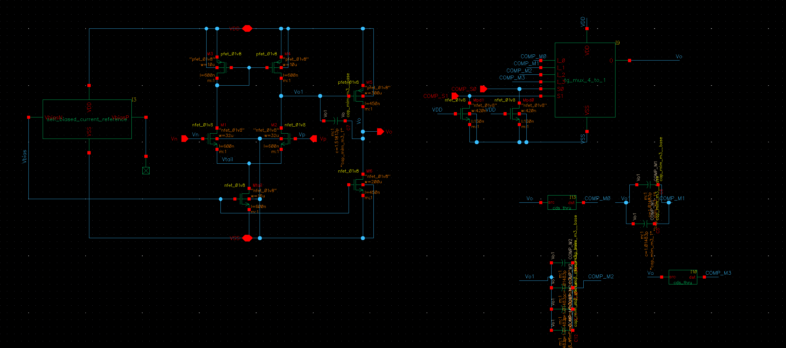
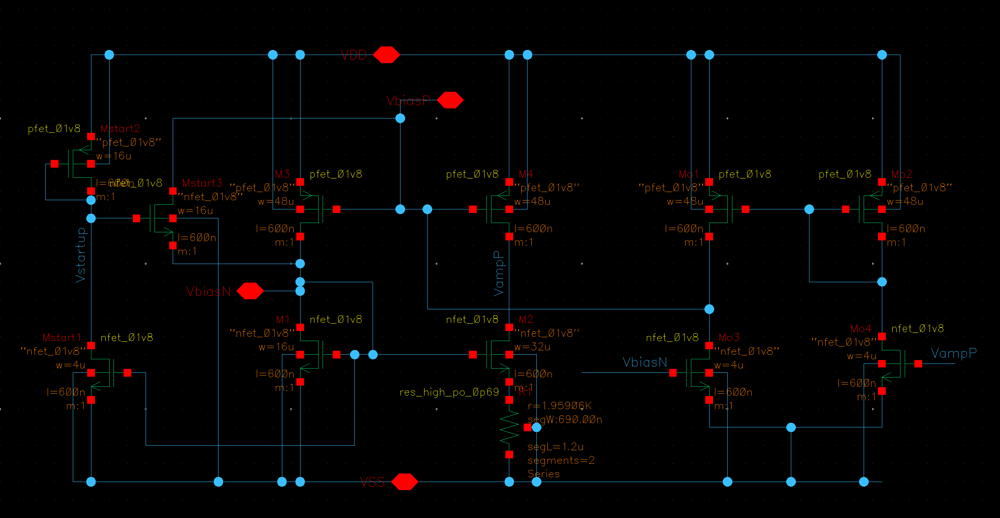
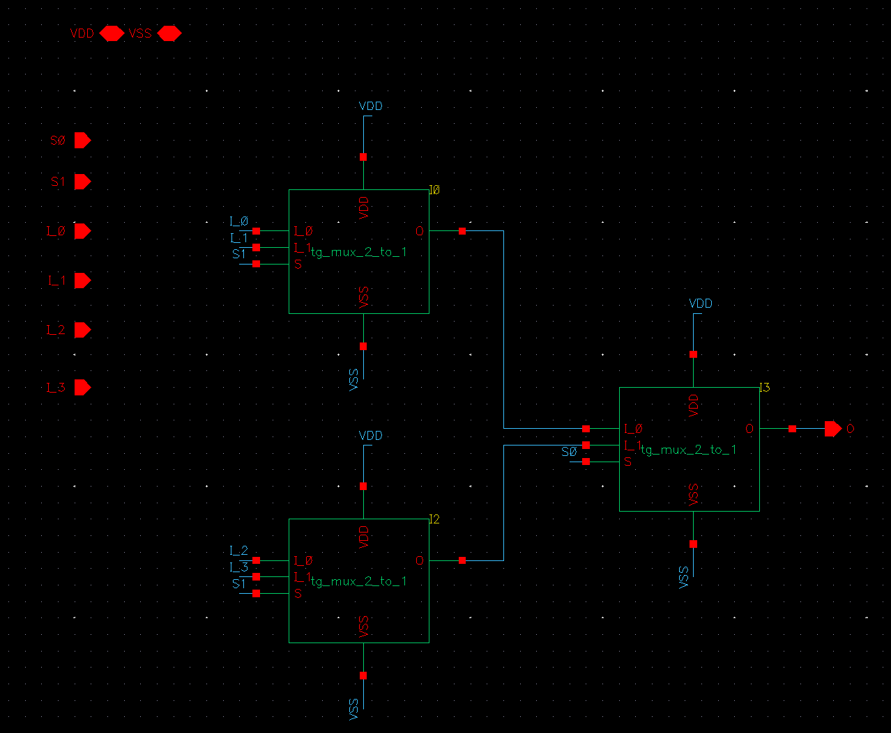
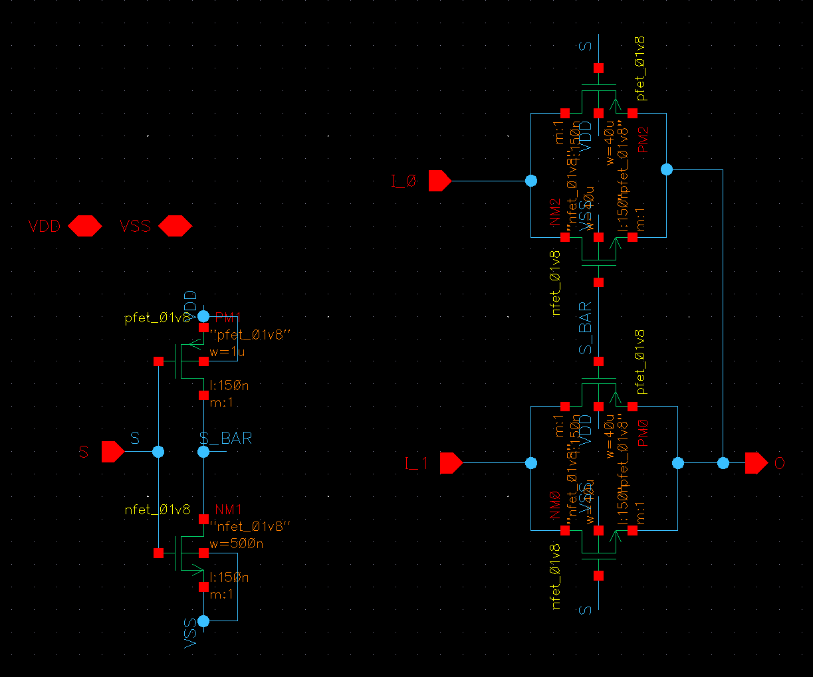
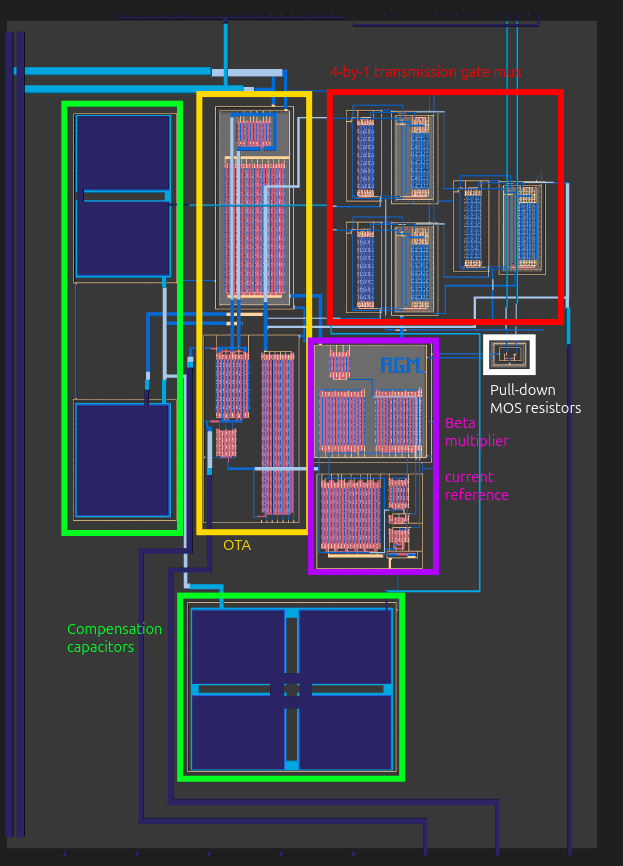
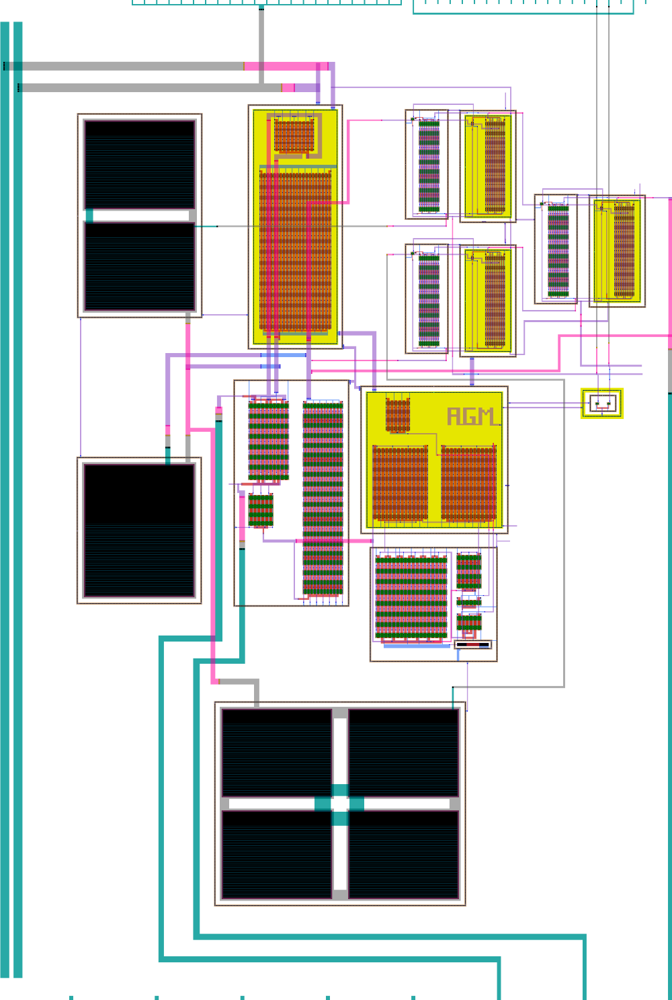

<!---

This file is used to generate your project datasheet. Please fill in the information below and delete any unused
sections.

You can also include images in this folder and reference them in the markdown. Each image must be less than
512 kb in size, and the combined size of all images must be less than 1 MB.
-->

## How it works

This project is a single-ended two-stage Miller-compensated OTA with a self-biasing beta multiplier current reference circuit and configurable compensation on SKY 130nm.

### Pins

| Name | No. | Description |
| --- | --- | --- |
| OUT | ua[0] | OTA output |
| IN+ | ua[1] | OTA non-inverting input |
| IN- | ua[2] | OTA inverting input |
| COMP_S0 | ui[0] | Miller compensation mode select 0 (MSB) |
| COMP_S1 | ui[1] | Miller compensation mode select 1 (LSB) |
| BEAT | uo[0] | Heartbeat status signal; tied to CLK |

| COMP_S1 | COMP_S0 | Behavior |
| --- | --- | --- |
| 0 | 0 | Compensation capacitance of 1.5 pF (default) |
| 0 | 1 | Compensation capacitance of 3.5 pF |
| 1 | 0 | Compensation capacitance of 5.5 pF |
| 1 | 1 | DNU |

### Specifications

#### Absolute Maximum Ratings

| Name | Min | Max | Unit |
| --- | --- | --- | --- |
| Supply voltage, VDD | 0 | 1.95 | V |
| Supply voltage, VSS | 0 | 1.95 | V |
| Input voltage, any input | 0 | 1.95 | V |
| Operating temperature | -40 | 100 | °C |

#### Recommended Operating Conditions

| Name | Min | Max | Unit |
| --- | --- | --- | --- |
| Supply voltage, VDD | 1.7 | 1.9 | V |
| Supply voltage, VSS | 0 | 0 | V |
| Operating temperature | -40 | 85 | °C |

#### Electrical Characteristics

All reported characteristics are based on pre-layout simulations across PVT corners with COMP_S1 = COMP_S0 = 0, 1.7 < VDD < 1.9, and -40 °C < T < 85 °C. Input values and temperatures outside of this range may cause values beyond the minimum or maximum values provided below.

| Name | Test Condition | Min | Typ. | Max | Unit |
| --- | --- | --- | --- | --- | --- |
| Vio, input offset voltage | Vo = 900 mV, full temp. range |  | 0.1 | 3 | mV |
| Vos, maximum peak-to-peak output voltage swing | Vo,DC = 900 mV, THD < 5%, full supply voltage range, full temp. range | 0.7 | 1.3 | | V |
| Avo, small-signal differential voltage amplification | Vin,cm = 900 mV, full temp. range | 1 | 4.5 |  | V/mV |
| gm, small-signal differential transconductance | Vin,cm = 900 mV, RL = 10 kΩ, full temp. range | 50 | 200 |  | mS |
| GBW, gain-bandwidth product | measured at corner frequency, full temp. range | 5 | 20 | 30 | MHz |
| PM, phase margin | measured at unity-gain bandwidth, full temp. range, C_L = 10 pF | 35 | 50 |  | ° |
| ro, small-signal output resistance | full temp. range | 1 | 6 | 12 | kΩ |
| CMRR, common-mode rejection ratio | full temp. range | 50 | 70 | | dB |
| PSRR+, power supply rejection ratio (VDD) | VDD = 1.8 V, full temp. range | 45 | 80 | | dB |
| PSRR-, power supply rejection ratio (VSS) | VSS = 0 V, full temp. range | 45 | 80 | | dB |
| Isc, short-circuit output current | full temp. range | 5 | 15 | | mA |
| P, passive power consumption | full temp. range, Vo = 0 V, no load | | 0.6 | 2 | mA |

### Schematics

#### OTA

#### self_biased_current_reference

#### tg_mux_4_to_1

#### tg_mux_2_to_1

### Layout

## How to test

This OTA should be operated in a feedback configuration. One common configuration to verify basic operation could be to tie the inverting input (ua[2]) to the output (ua[0]) to create a unity-gain buffer, where any input signal fed into the non-inverting input (ua[1]) should be matched at the output. Gain-bandwidth product (GBW) can be estimated by finding the frequency at which the voltage gain begins to drop below 1 V/V in this configuraton.

## License

Copyright (c) atenfyr, 2026, under the Apache License 2.0.
