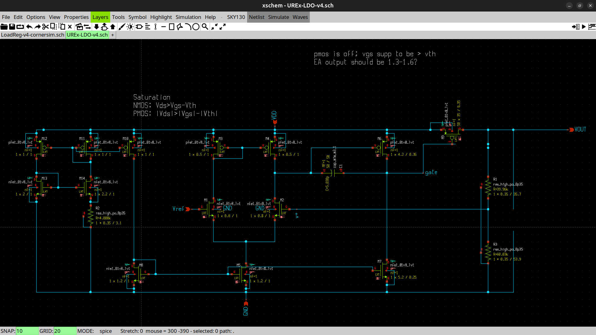

<!---

This file is used to generate your project datasheet. Please fill in the information below and delete any unused
sections.

You can also include images in this folder and reference them in the markdown. Each image must be less than
512 kb in size, and the combined size of all images must be less than 1 MB.
-->

## How it works

Just a low-drop out regulator that takes in 1.2V-3V on an analog pin and outputs 1V through another analog pin.

Its expected characteristics are:
* output voltage: 1V
* dropout voltage: 0.2V
* maximum output current: 50mA
* efficiency: 82% @Vin=1.2V, 55% @Vin=1.8V
* max Vin: 4V
* line regulation: 6.78mV/V
* load regulation: 67mV/A

## How to test

Connect Vin to your input voltage and Vref to 0.6V, Vout is the output voltage

## External hardware

List external hardware used in your project (e.g. PMOD, LED display, etc), if any
