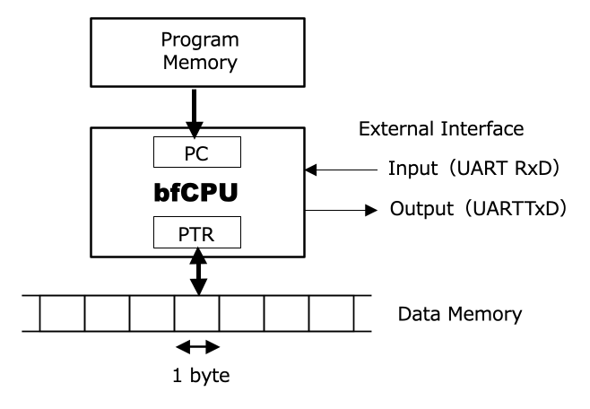
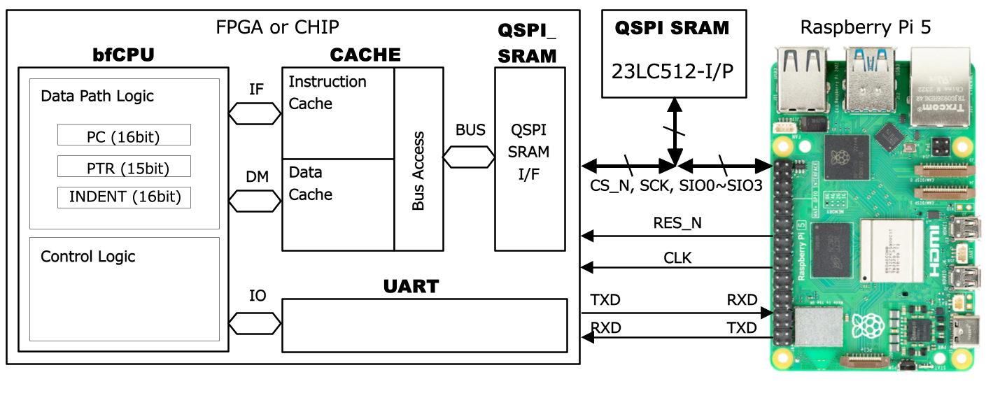
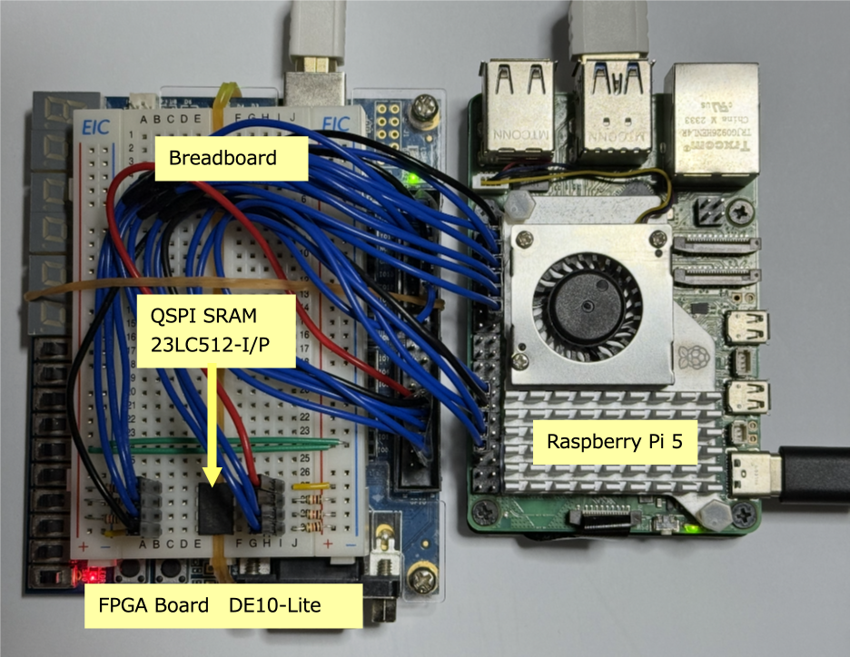
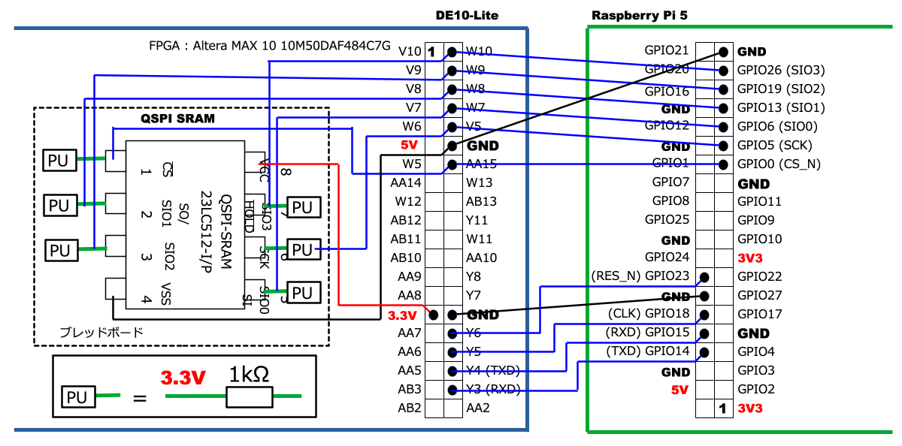

# bfCPU, a Turing-complete machine
The objective of this project is to design a **Turing-complete machine** for Tiny Tapeout. You can find detail information of bfCPU in [[bfCPU]](https://github.com/munetomo-maruyama/bfCPU).

## Building the Turing-Complete bfCPU
One of the most famous examples of a simple, yet fully Turing-complete machine is the architecture proposed in 1993 by Urban Müller of Switzerland, known as Brainf*ck (where * is 'u') [[Wiki bfCPU]](https://en.wikipedia.org/wiki/Brainfuck). I have obscured one letter due to the somewhat indelicate nature of the name; in this project, I will refer to this CPU architecture as "bfCPU." The bfCPU is an 8-bit CPU with only eight commands. Remarkably, these few commands are sufficient to implement any arbitrary algorithm. We will actually design this CPU, implement it on an FPGA, and ultimately enjoy the process of turning it into silicon via Tiny Tapeout.

## The bfCPU Architecture

### The Profundity of bfCPU
Programs written for bfCPU have extremely low readability and writability, earning it a spot among "esoteric programming languages" (esolangs). Even performing a simple addition feels like solving a complex puzzle. When we write a program for bfCPU, we find ourselves inadvertently and mischievously grinning. Indeed, I found myself grinning as well when I first encountered bfCPU.

### Basic Architecture of bfCPU
The basic architecture of the bfCPU is shown in below.

The internal resources of the bfCPU consist solely of a Program Counter (PC) and a Data Memory Pointer (PTR). The PC indicates the address of the instruction stored in the program memory. The CPU fetches the instruction from the program memory at the address pointed to by the PC, and according to that instruction, it either manipulates the Data Memory Pointer (PTR) or accesses the data at the address in the data memory pointed to by the PTR. Each address in the data memory stores 8-bit (byte-sized) data.

Furthermore, there is an I/O mechanism for interfacing with the outside world. In the bfCPU designed for this project, external input is handled as received data via a UART (Universal Asynchronous Receiver/Transmitter), and external output is handled as transmitted data from the UART. The structure of the bfCPU is as simple as that.

### bfCPU Instruction Set
The list of the bfCPU instruction set is shown in table below. The bfCPU originally features only eight instructions with opcodes (binary) from `0000` to `0111`. While 3 bits would suffice for eight instructions, the bfCPU designed here includes two additional instructions (`reset` and `nop`), resulting in a 4-bit instruction code length. All of these instruction codes consist only of an opcode indicating the operation; they have a simple structure with no operands to specify targets.

The original instruction notation for bfCPU consists of single characters shown in the "Symbol" column of the table below (`<`, `>`, `+`, `-`, etc.). A program is formed by lining up these characters without gaps, or with occasional spaces and line breaks, which is why it is called an esoteric language. As described later, I have developed an assembler and instruction simulator called **bfTool** for bfCPU program development. This assembler accepts the original single-character bfCPU instructions, allowing the use of the vast number of publicly available bfCPU programs. However, it also supports the "Mnemonic" descriptions to improve readability. The "C-Equivalent" column represents the operation of each instruction in the C language. Note that while the original bfCPU uses ASCII characters directly as the program, the bfCPU designed in this article replaces each instruction with a 4-bit instruction code.

**Table: bfCPU Instruction Set**
| Instruction Code (Hex) | Mnemonic | Symbol | C-Equivalent | Description |
| :--- | :--- | :---: | :--- | :--- |
| 0x0 | INC_PTR | `>` | `++ptr;` | Increment the data pointer. |
| 0x1 | DEC_PTR | `<` | `--ptr;` | Decrement the data pointer. |
| 0x2 | INC_DATA | `+` | `++*ptr;` | Increment the byte at the data pointer. |
| 0x3 | DEC_DATA | `-` | `--*ptr;` | Decrement the byte at the data pointer. |
| 0x4 | OUTPUT | `.` | `putchar(*ptr);` | Output the byte at the data pointer. |
| 0x5 | INPUT | `,` | `*ptr = getchar();` | Input a byte and store it at the data pointer. |
| 0x6 | JMP_FWD | `[` | `while (*ptr) {` | Jump forward past `]` if the byte at the pointer is 0. |
| 0x7 | JMP_BACK | `]` | `}` | Jump back to the command after `[` if the byte at the pointer is non-zero. |
| 0x8 | NOP | - | - | No operation. |
| 0xF | RESET | - | - | Reset the CPU state. |

### Important Notes on bfCPU Programs
The `begin` ([) and `end` (]) instructions can be nested to any depth, but they must always be correctly paired. Additionally, while the data width of each cell in the data memory is 8 bits (one byte), the values wrap around: adding 1 to `0xFF` results in `0x00`, and subtracting 1 from `0x00` results in `0xFF`. There are no flags to indicate the occurrence of a carry, borrow, or overflow.

## bfCPU Assembler and Simulator: **bfTool**
I have developed **bfTool**, a development utility for creating bfCPU programs and simulating instruction behavior on a PC. It is located in the `bfCPU/bfTool` directory within the repository. Please refer to [[bfTool]](https://github.com/munetomo-maruyama/bfCPU) for the details.

## bfCPU Program Examples
Some sample programs are stored in the [[Sample Programs]](https://github.com/munetomo-maruyama/bfCPU/bfTool/samples). 

- addition.asm: Addition
- multiplication.asm: Multiplication
- inputdec.asm: Receives a decimal ASCII string via UART and converts it to a binary value.
- printdec.asm: Converts a binary value to a decimal ASCII string and transmits it via UART.
- tictactoe.asm: Tic-Tac-Toe game.
- life.asm: Conway's Game of Life.

I believe each of these programs is a high-effort masterpiece. Many other programs for the bfCPU (Brainfuck) architecture are also available online: [[esolangs]](https://esolangs.org/wiki/Brainfuck).

The bfCPU is recognized as a Turing-complete machine, meaning it is capable of performing any computational task possible for a computer. However, programs tend to become highly cryptic, and execution times can be quite long. Nevertheless, the process of solving these "puzzles" is profound and offers the ultimate form of intellectual entertainment.

## Design of the bfCPU System
The overall configuration of the bfCPU system is shown in the block diagram below. The interior of the chip or FPGA (bfCPU chip) incorporates the bfCPU core, cache memory, a QSPI SRAM interface, and a UART. For external memory, a single 512Kbit (64Kbyte) QSPI SRAM 23LC512 (Microchip) is connected.

All RTL files and simulation stuffs are stored in [[bfCPU]](https://github.com/munetomo-maruyama/bfCPU).

## Implementing the bfCPU System on an FPGA
### FPGA Board to be Used
The designed bfCPU system will be implemented on an FPGA. The board used is the DE10-Lite (Official Website) from Terasic (Taiwan). The FPGA design resources can be found in [[bfCPU]](https://github.com/munetomo-maruyama/bfCPU).

### Setting Up the bfCPU Development Environments **bfTool** and **bfRun** on Raspberry Pi 5
Detail information how to setup and use the tools are described in [[bfCPU]](https://github.com/munetomo-maruyama/bfCPU).

- **bfTool** : You can build the bfCPU Assembler and Simulator: **bfTool** on RasPi5.
- **bfRun** : The RasPi5 is responsible for writing programs to the QSPI SRAM and booting the bfCPU. The utility for this task is **bfRun**. You can also build it on RasPi5. 

## Implementing the bfCPU System on Tiny Tapeout Chip
The top level RTL is `tt_um_bfcpu.sv`, and the I/O signals are summarized in the table shown below.

**Table: bfCPU I/O Signals**
| Pin name | Direction | Function | Description |
| :--- | :--- | :---: | :---: |
| ui[0] | input | - | - |
| ui[1] | input | - | - |
| ui[2] | input | - | - |
| ui[3] | input | - | - |
| ui[4] | input | - | - |
| ui[5] | input | - | - |
| ui[6] | input | - | - |
| ui[7] | input | UART_RXD | UART Receive Data |
| uo[0] | output | UART_TXD | UART Transmit Data |
| uo[1] | output | - | - |
| uo[2] | output | - | - |
| uo[3] | output | - | - |
| uo[4] | output | - | - |
| uo[5] | output | - | - |
| uo[6] | output | - | - |
| uo[7] | output | - | - |
| uio[0] | inout | - | - |
| uio[1] | inout | - | - |
| uio[2] | inout | QSPI_SIO2 | QSPI Memory Data bit2 (Open Drain) |
| uio[3] | inout | QSPI_SIO3 | QSPI Memory Data bit3 (Open Drain) |
| uio[4] | inout | QSPI_CS_N | QSPI Chip Select (Open Drain) |
| uio[5] | inout | QSPI_SCK  | QSPI Clock (Open Drain) |
| uio[6] | inout | QSPI_SIO0 | QSPI Memory Data bit0 (Open Drain) |
| uio[7] | inout | QSPI_SIO1 | QSPI Memory Data bit1 (Open Drain) |

Have Fun!

