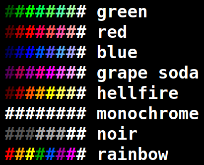

## How it Works

This is a standalone VGA demo that runs with or without input, replicating *The
Matrix* Digital Rain effect. However, **all** 8 input pins *and* the reset pin
are used for some effect or display modifier.

Upon circuit reset, the glyphs will appear to fall from the top of the screen.
Additionally, some glyphs will intermittently change.

 - Select one of eight palettes with the three pins `ui_in[2:0]`
 - Mix multiple palettes with the fourth pin, `ui_in[3]`
 - Pause the animation with the fifth pin, `ui_in[4]`
 - Alternative pattern (second monitor) with the sixth pin, `ui_in[5]`
 - Change the display resolution mode with pins `ui_in[7:6]`

**NOTE**: The default VGA timing requires a pixel clock of 25.175 MHz. If you
want to drive higher resolutions, the base clock rate must be adjusted
accordingly with the **Display Clocks** table below. While these other modes
use standard display timings, you should check with your display documentation
to verify that the modes are supported. You must also set the two pins
`ui_in[7:6]` to select your preferred mode. Both the 720p and 1080p30 modes use
the same clock of 74.25 MHz.

Each display mode has been tested with a Basys 3 board using a modern 4K LCD
display and a VGA to HDMI converter. There were challenges driving this circuit
at frequencies high enough to support 1080p at 60 frames per second (FPS).
Internally, the animation doesn't need to move at 60 FPS for the effect, so the
Full High Definition (FHD) at 30 FPS timing mode was a fortunate design point.

## How to Test

Plug into a VGA monitor and select this circuit to test. By default, the
circuit must be clocked at (or very near) to **25.175 MHz**. There are four
display timing modes, representing four different display resolutions, which
must be both specifically clocked *and* have the pins `ui_in[7:6]` set
according to the table below. Some modes may not be compatible with your
monitor, but virtually every monitor should support the historical VGA mode.

### Display Clocks

**Pins 6 and 7 must be paired with pixel clock**

| `ui_in[7:6]` | Clock (Hz) | VGA Timing Mode            |
|-------------:|-----------:|---------------------------:|
|  (default) 0 |   25175000 |  640 x  480 @ 60 FPS (VGA) |
|            1 |   65000000 | 1024 x  768 @ 60 FPS (XGA) |
|            2 |   74250000 | 1280 x  720 @ 60 FPS (HD)  |
|            3 |   74250000 | 1920 x 1080 @ 30 FPS (FHD) |
 
### Palette Input

Use **Pins 0, 1, and 2** `ui_in[2:0]` for palette selection:

| `ui_in[2:0]` | Palette    |
|-------------:|:-----------|
|  (default) 0 | Green      |
|            1 | Red        |
|            2 | Blue       |
|            3 | Grape Soda |
|            4 | Hellfire   |
|            5 | Monochrome |
|            6 | Noir       |
|            7 | Rainbow    |

## External hardware

Requires the [TinyVGA PMOD](https://github.com/mole99/tiny-vga)
