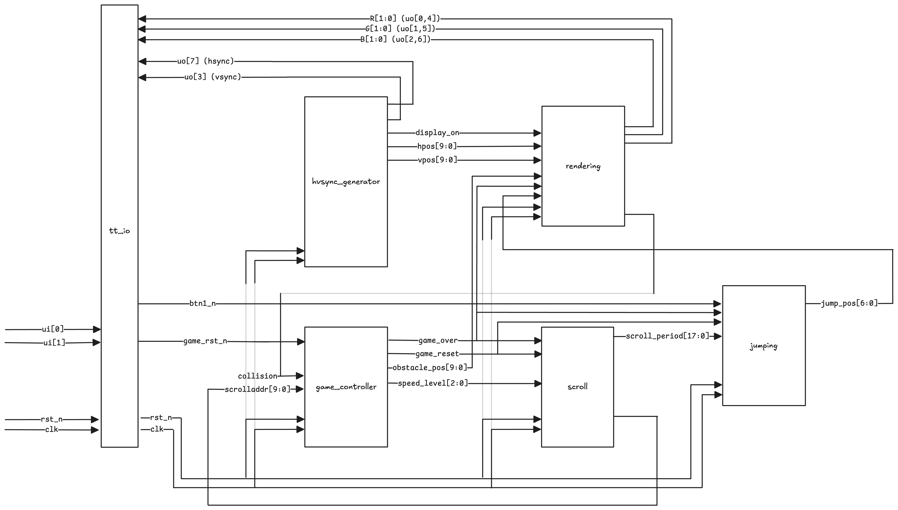
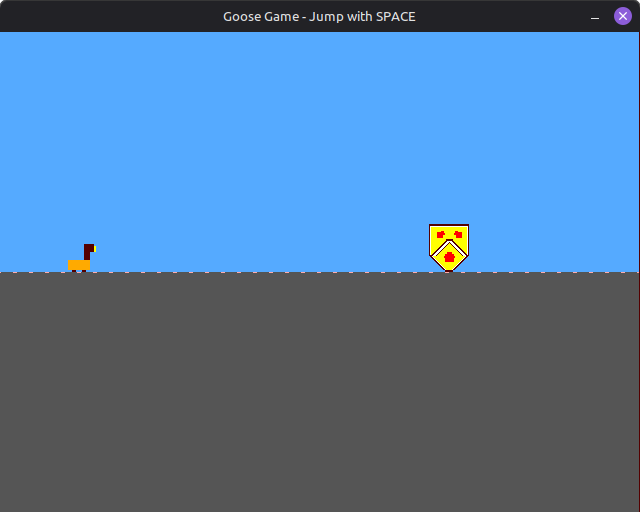
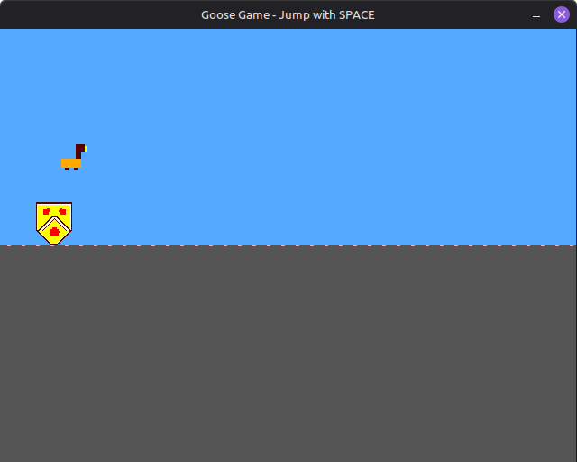
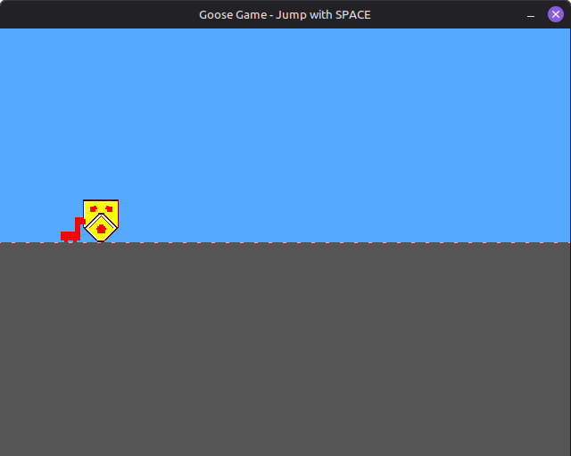

<!---
This file is used to generate your project datasheet. Please fill in the information below and delete any unused
sections.

You can also include images in this folder and reference them in the markdown. Each image must be less than
512 kb in size, and the combined size of all images must be less than 1 MB.
-->

## How it works

The Goose Game is a Chrome Dino-style endless runner game implemented in Verilog for Tiny Tapeout ASIC fabrication. The game features a goose character that must jump over obstacles (University of Waterloo emblem) that scroll across the screen. The design outputs RGB222 VGA video at 640x480 @ 60Hz resolution.

### Architecture Overview

The design is organized into six main modules that work together to create a complete game system:

1. **`goose_game_top.v`** - Top-level module that instantiates and connects all sub-modules
2. **`game_controller.v`** - Central game logic including state machine, collision handling, obstacle spawning, and speed progression
3. **`rendering.v`** - VGA rendering engine with sprite storage, layered compositing, and pixel-accurate collision detection
4. **`jumping.v`** - Parabolic jump physics using lookup table with mirrored ascent/descent
5. **`scroll.v`** - Horizontal scrolling logic with configurable speed levels
6. **`hvsync_generator.v`** - VGA timing signal generation (hsync, vsync, display_on)

### System Flow



### Key Design Specifications

- **Clock Frequency**: 25 MHz (VGA pixel clock)
- **Resolution**: 640x480 @ 60Hz
- **Color Depth**: RGB222 (2 bits per channel, 64 total colors)
- **Game Area**: Ground positioned at Y=240
- **Goose Sprite**: 16×16 ROM (displayed as 32×32 pixels)
- **Obstacle Sprite**: 40×48 pixels (University of Waterloo emblem)
- **Jump Height**: 104 pixels maximum
- **Speed Levels**: 8 discrete levels (0-7) with progressive difficulty

### Module Responsibilities

#### Game Controller (`game_controller.v`)
Manages the overall game state and logic:
- Implements game state machine (running, game over)
- Manages obstacle position cycling (700 pixel cycle)
- Handles collision detection input and game over state
- Implements speed progression system (8 levels, increments every ~5 seconds at 25MHz)

#### Rendering Module (`rendering.v`)
The VGA rendering engine that generates all visual output:
- Stores goose sprite in packed ROM format (16x16, 3-bit color indices)
- Renders University of Waterloo emblem procedurally
- Implements layered compositing system (goose > obstacle > floor dots > floor > sky)
- Performs pixel-accurate collision detection by checking layer overlap
- Generates scrolling ground texture with dotted pattern
- Handles game over visual feedback (goose turns red)

#### Jumping Module (`jumping.v`)
Handles the goose's vertical movement:
- Implements parabolic jump trajectory using 26-entry lookup table with frame mirroring
- Manages jump state machine (grounded, in-air, jump complete)

#### Scroll Module (`scroll.v`)
Controls horizontal obstacle movement:
- Generates horizontal scroll position counter
- Implements 8-level speed system with period lookup table
- Halts scrolling when game over is detected

#### HVSync Generator (`hvsync_generator.v`)
Generates VGA timing signals:
- Produces VGA timing signals per the standard
- Horizontal: 640 display + 16 front porch + 96 sync + 48 back porch = 800 total
- Vertical: 480 display + 10 front porch + 2 sync + 33 back porch = 525 total
- Provides pixel position outputs (hpos, vpos) for rendering engine

### Key Design Challenges and Solutions

#### Challenge 1: Scaling Difficulty Without Excessive Storage

**Problem**: Implementing progressive difficulty scaling was challenging without consuming significant storage area. Simply increasing scroll speed would make the game harder, but this created a secondary issue where the goose would jump too far relative to the faster obstacles, making the game progressively easier instead of harder.

**Solution**: 
- **Scroll Speed LUT**: Implemented a simple lookup table to decrease scroll periods as speed level increases, making obstacles move faster across the screen
- **Reusing Scroll Period for Jump**: To keep jump feel consistent and avoid the cost of another LUT for jump speed, we reused the `current_period` value from the scroll lookup table and applied an inexpensive bit shift operation (`jump_speed = scroll_period << 1`) to scale the jump animation speed proportionally
- This solution required minimal additional storage (just the LUT) while solving both the scroll speed and jump timing issues simultaneously

#### Challenge 2: Maximizing Obstacle Spawning Frequency

**Problem**: Initially attempted to have multiple emblems on screen simultaneously to increase difficulty, but this dramatically increased area utilization due to the need to store position data for each additional obstacle.

**Solution**:
- **Single Obstacle with Frequent Spawning**: Instead of multiple obstacles, we tuned the spawning parameters to spawn a new obstacle as soon as the previous one despawns
- By carefully tuning the `OBSTACLE_CYCLE` parameter (700 pixels), we ensure only one obstacle is on screen at a time, but it appears very frequently
- This approach, combined with the speed progression system, provides increasing difficulty without the area cost of storing multiple obstacle positions

#### Challenge 3: Efficient Collision Detection

**Problem**: Collision detection needed to be pixel-accurate and area-efficient, working seamlessly with the rendering system.

**Solution**:
- **Layer-Based Metadata**: Leveraged the existing layered rendering approach to generate collision metadata naturally
- Each sprite sets a layer bit when it occupies a pixel during rendering
- Collision is detected combinatorially by checking if both goose and obstacle layers are active: `collision = layers[LAYER_GOOSE] & layers[LAYER_OBSTACLE]`
- This reuses the rendering logic rather than requiring separate collision detection hardware

#### Challenge 4: Jump Trajectory Storage Optimization

**Problem**: Storing a complete parabolic jump trajectory for 50 frames would require significant ROM area.

**Solution**:
- **Mirrored Trajectory**: Stored only the left-hand (ascending) side of the parabolic motion
- Used frame mirroring to generate the descending side: for frames 26-49, we mirror the corresponding ascending frame
- This reduces storage from 50 entries to 26 entries while maintaining a smooth, natural parabolic jump feel

#### Challenge 5: Sprite ROM Storage Optimization

**Problem**: Storing sprite pixel data in ROM consumes significant area. The goose sprite (16×16 pixels) would require substantial storage if each pixel's color data was stored naively.

**Solution**:
- **Packed ROM Format**: Instead of storing full RGB values or wide color indices, we store 3-bit color indices packed into wide registers
- Each row of the 16×16 sprite is stored as a single 48-bit register (16 pixels × 3 bits per pixel)
- A palette function converts the 3-bit indices to RGB222 color values during rendering
- This approach significantly reduces ROM width requirements compared to storing full color data

### Design Trade-offs

In pursuit of fitting the design onto the Tiny Tapeout square, several features were sacrificed:

- **Sound effects**: Audio output was not implemented to save area
- **Score tracking**: Score tracking was not implemented to save area
- **High score tracking**: No persistent high score storage
- **Custom ground texture**: Simplified to basic floor with minimal scrolling dots pattern
- **Higher quality sprites**: Sprites kept small (16×16 for goose) and simple to minimize ROM area
- **Multiple obstacles**: Only one obstacle on screen at a time to avoid storing multiple position registers

- **Jump Trajectory**: Used lookup table instead of real-time physics calculation. Saves area and ensures consistent, predictable jump behavior, but limits flexibility for different jump styles.

- **Speed Levels**: 8 discrete speed levels provide noticeable progression without requiring complex continuous speed calculation. However, the speed system could be more progressive with finer granularity between levels, but this would require additional storage or more complex arithmetic.

## How to test

### Required Hardware Test Setup

1. **Hardware Connections**:
   - Connect a TinyVGA PMOD to the output pins (`uo_out[7:0]`)
   - Connect the TinyVGA PMOD to a VGA monitor
   - Connect push buttons to:
     - `ui_in[0]`: Jump button (active-low)
     - `ui_in[1]`: Reset button (active-low)
   - Provide 25 MHz clock to `clk` input
   - Connect active-low reset to `rst_n` input

2. **Power On**:
   - Apply power to the Tiny Tapeout chip, and activate the `rst_n` input
   - The game should start automatically after reset

### Testing in Software Simulation

#### Verilator Visual Simulation

The primary testing method is the Verilator-based visual simulation, which provides real-time gameplay. Ensure you have all the necessary libraries, then run the following commands:

```bash
cd verilator
make all
./goosegame
```

**Controls in Simulation**:
- `SPACE` or `↑` = Jump
- `R` = Reset game
- `ESC` = Quit

**What to Verify per Test Run**:
- Game starts automatically on reset
- Goose jumps when jump button pressed
- Obstacles scroll from right to left smoothly
- Collision detected when goose hits obstacle
- Game over state stops scrolling and turns goose red
- Reset button restarts game correctly
- Speed increases over time (noticeable after ~5 seconds)

### Test Infrastructure

#### Verilator Testbench (`verilator/goosegame_tb.cpp`)
- Provides visual simulation with SDL2
- Allows real-time button input via keyboard
- Displays RGB222 output expanded to ARGB format

### Known Limitations of Pre-Tapeout Testing Mechanism

1. **Manual Testing Required**: The Verilator simulation requires manual gameplay to verify features, making it difficult to systematically test higher speed levels and edge cases.
2. **Performance-Dependent Timing**: Simulation speed varies with host machine performance. On lower-powered machines, the simulation runs slower than real-time, while on high-performance machines it may run faster, making timing-dependent verification inconsistent.
3. **Regression Risk**: The lack of automated test cases means that if a feature is missed during manual testing, it may not be caught until a later test, increasing the risk of regressions.


## External hardware

### Required Hardware

- **TinyVGA PMOD**: Connects to `uo_out[7:0]` for VGA output
- **VGA Monitor**: Standard VGA display connected via TinyVGA PMOD
- **Push Buttons**: Two active-low buttons connected to `ui_in[0]` (jump) and `ui_in[1]` (reset). External debouncing recommended but not strictly required.
- **Clock Source**: 25 MHz (or 25.175 MHz) connected to `clk`
- **Reset Signal**: Active-low reset connected to `rst_n`

### Pin Mapping

#### Inputs
- **`ui_in[0]`**: Jump button (`bt1_n`) - Active-low, press to jump
- **`ui_in[1]`**: Reset button (`game_rst_n`) - Active-low, press to reset game state
- **`ui_in[7:2]`**: Unused
- **`clk`**: 25 MHz clock input
- **`rst_n`**: Active-low system reset

#### Outputs (TinyVGA PMOD Format, RGB222, 64 Colors)
The `uo_out[7:0]` pins are mapped as follows:
- **`uo_out[7]`**: HSync (Horizontal synchronization)
- **`uo_out[6]`**: B0 (Blue LSB)
- **`uo_out[5]`**: G0 (Green LSB)
- **`uo_out[4]`**: R0 (Red LSB)
- **`uo_out[3]`**: VSync (Vertical synchronization)
- **`uo_out[2]`**: B1 (Blue MSB)
- **`uo_out[1]`**: G1 (Green MSB)
- **`uo_out[0]`**: R1 (Red MSB)

#### All bidirectional pins are unused.

## Other info

### Game Screenshots







### Acknowledgements

- **ECE298a Staff: Prof. John Long, Refik Yalcin**
- **a1k0n's TinyTapeout Submission**: [tt08-vgademo](https://github.com/a1k0n/tt08-vgademo)

---

*Documentation for Goose Game - ECE298a Tiny Tapeout Project*  
*Authors: Krish Patel, Sunnie Kapar*
