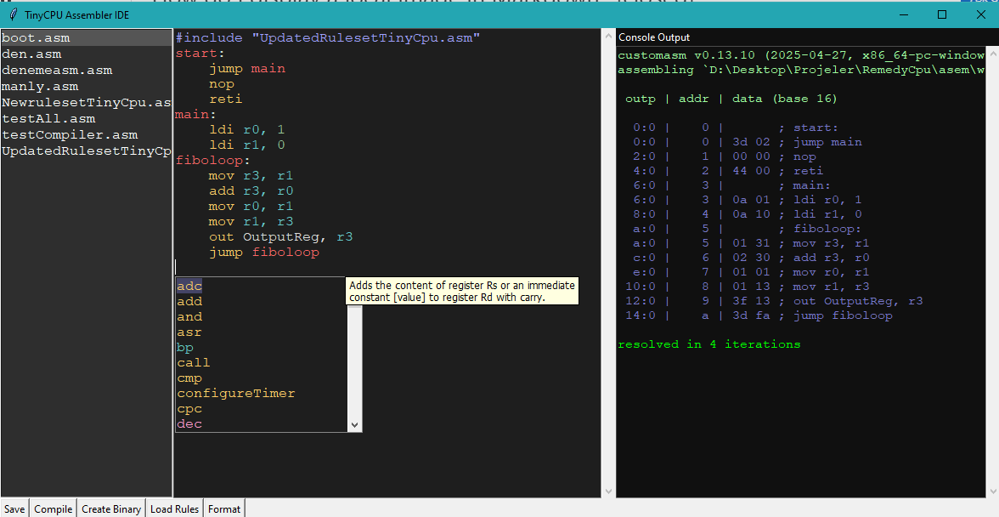
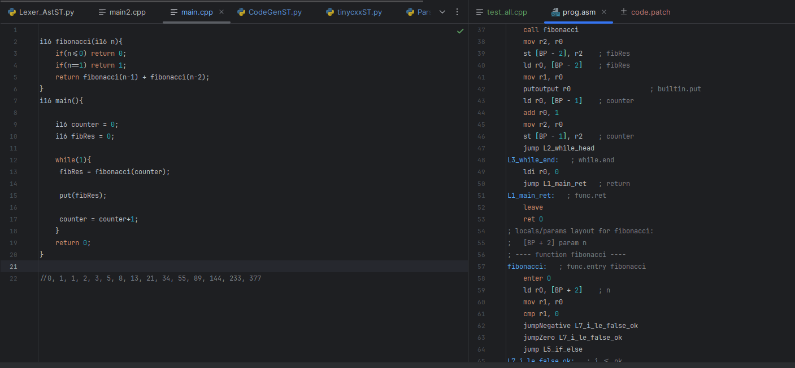
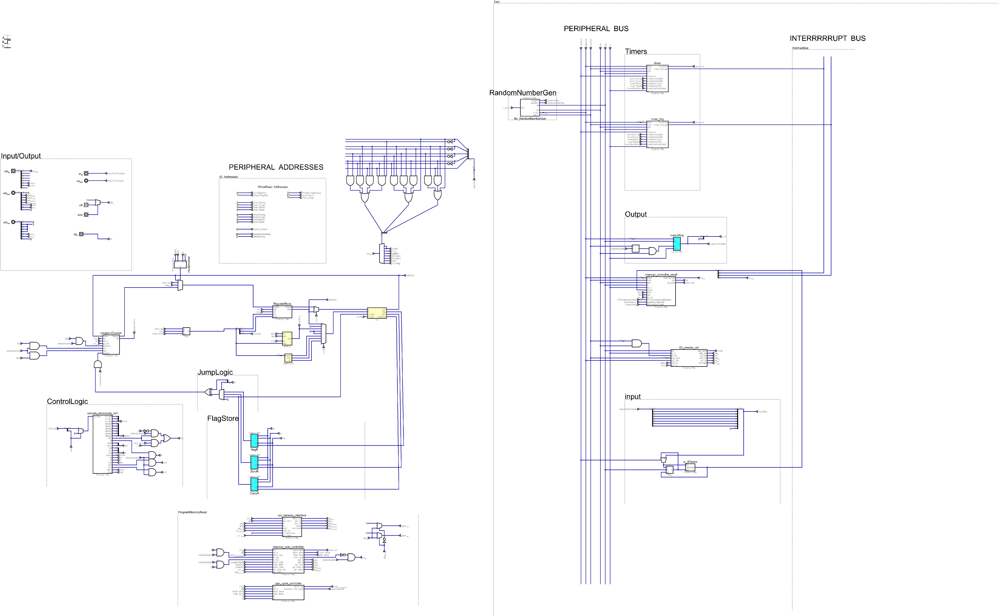

<!---

This file is used to generate your project datasheet. Please fill in the information below and delete any unused
sections.

You can also include images in this folder and reference them in the markdown. Each image must be less than
512 kb in size, and the combined size of all images must be less than 1 MB.
-->

## How to test

Using this custom IDE to compile assembly or cpp-ish code and upload it to the spi flash.
[repo link here hopefully If I don't forget]
### Assembler

### Work in progress compiler


## External hardware

with PMOD or external spi flash/ram. Currently only use regular spi mode to communicate.

## How it works
Read program from spi flash and executes its instructions. Depending on the program it cna also use 1 ram. It will only use address 0x00000-0x1ffff. So it will use really small amount for both spi flash and ram.
**OH You can only read/write to ram with half-words and also read flash with half-words**
so if the memory at 0x00 is something like **0x3df12548** you can read **0x3df1** or **0x2548** but you can't read **0xf125**

# CPU SPECS

## Overview
CPU SPECS
External spi Flash up to 131kb
External spi Ram up to 131kb
(it can only use addresse between 0x00000-0x1FFFF)

First you send read command to spi flash 
Then send 16 bit program address from cpu
Then read 16 bit opcode
and after a clock cycle or two it will execute it.
Rinse and repeat

## SPI Fetch Timing
    

-0x03 Read command(Write) [8 bits]
-Program Counter(Program Address)(Write)  [24 bits]
-Opcode(Operation code)(Read) [16 bits]
-3 clock cycle
          


Yeah i know it is slow but it is what it is :D
Anyway here is the full cpu specs
## Notes
Total of **16** general purpouse registers that can hold 16 bit numbers
 or 13 general purpouse registers and stack pointer, branch pointer, return address registers

- **A Random number generator (linear feedback shift register)** that generates 8 bit random numbers at every clock cycle but you need toset a seed first
- **2 timers** with:
    - **timer1** is **16-bit** and **timer2** is **8-bit**
     - Auto Reload functionality after reaching the target value
     - Interrupt generation upon reaching the target
     - Capability to read the timer value
     - Timer reset functionality
     - 16-bit prescaler ranging from 1x (1 clock cycle per tick) to 32768x (32768 clock cycles per tick)

- **I2C master** with:
     - Raise an interrupt when finished transaction
     - Not much tested clock s_____trecth support
     - Ack Nack capability
     - 16 bit Prescaler
     - Write/Read operations
     - Typical I2c master... but it can only hold 8 bit of data so it needs constant attention
      For example lets say you want to read from device 0x58 and its 0x14th register
        - Enable interrupt (otherwise you need to poll it)
        - START command + ADDR(W) -> it finished sending it and raised an interrupt
        - WRITE register addr     -> it finished sending it and raised an interrupt
        - START command + ADDR(R) -> it finished sending it and raised an interrupt
        - READ register content   -> it finished sending it and raised an interrupt
        - then you copy the value from peripheral bus to cache registers.
        - And then you can copy from cache registers to ram.

-**Arithmetic Logic Unit** (ALU) capabilities include:
  - Addition
  - Subtraction
  - Bitwise AND
  - Bitwise OR
  - Bitwise XOR
  - Bitwise NOT
  - Negation
  - Logical shift left
  - Logical shift right
  - Arithmetic shift right
  - Byte swapping
  - Nibble swapping
  - ALU Flags: Negative, Zero, Carry

-**Immediate register** for storing 16-bit values

-**Jump instructions** supporting both absolute and relative addresses
  abs(current address - target address) < 128 -> Relative jump - 1 cycle
  abs(current address - target address) > 128 -> Absolute jump - 2 cycle

-Input pins can trigger interrupts (not edge-sensitive, shared interrupt line, global enable/disable) 
  -Input pins can generate interrupt but it is not edge sensitive   
  and it is not possible to disable interrupt for a specific pin
  because all input pins share the same interrupt line
  so the interrupt happens when any of the input pins change (and you don't know which one caused it)

-Interrupts can be enabled or disabled globally
  Interrupt register to manage and read active interrupts (1 I2C master, 2 timers, 1 input pin)
  - Interrupt register format:
      |    15-4    |    3   |    2   |   1    |       0        |
      |------------|--------|--------|--------|----------------|
      |  always 0  |  I2C   | timer2 | timer1 | input Interrupt |
  - When an interrupt happens you need to flip the bit on the interrupt register to 0
  otherwise it will trigger an interrupt again.
  - While returning from interrupt you need to use "**reti**"
  - all interrupt use the same function address and it is hardcoded to **0x0002**
  - When an interrupt happens if the current operation is not a immediate or ram write/read operation
  it will record current pc and jump to **0x0002**. When you finish handling the interrupt use "**reti**" to continue
  - if another interrupt happens for some reason it will not jump to **0x0002**. But as soon as you use "**reti**"
  it will jump back to interrupt handler.
  - Normally when an interrupt happens it will lock the interrupt bus so other interrupts doesn't happen.
  well.... sometimes they don't listen....
  


## REGISTERS

```text
;---------- REGISTERS   -------------
; this timer is 16-bit
timer1Config = 2         ;5-bit    |    1 bit       |  1 bit  |    4 bit   | 1 bit  |  
                         ; not used|Interrupt enable| reload  |  prescaler | enable |
 
timer1Target = 3         ; 16-bit target value for interrupt generation
timer1Reset = 4          ; 1-bit reset timer
timer1ReadAdr = 5        ; 16-bit

; this timer is 8-bit
timer2Config = 6         ; Similar configuration as timer1
timer2Target = 7         ; 8-bit target value for timer2
timer2Reset = 8          ; 1-bit reset timer2
timer2ReadAdr = 9       ; 8-bit

timerSyncStart = 10       ;1-bit, when set to 1, it starts all timers at the same time.
; random number generator
; RNG is always active at every clock cycle
RandomSeedAddr = 11        ;16-bit seed location
RandomReg = 12              ;Generated value

; GPIO Registers
OutputReg = 1          ; 8-bit data for GPIO pins
InputReg = 0           ;8-bit data from GPIO pins 

; Interrupt registers
CpuinterruptEnable = 13       ; 1-bit
InputInterruptEnable = 14   ;1-bit if 1, input pins interrupt is enabled
InterruptRegister = 15      ;16-bit

I2cCtrl = 16                   ; |    1 bit      |  1 bit     |  1 bit  |
                               ;   strech enable | irq enable | enable  |
I2cStatus = 17
; |    1 bit    |    1 bit      |  1 bit     |  1 bit  |         1 bit         |        1 bit       |
;  irq pending  | rx valid      | ack error  | done    | bus active(read only) | op busy (read only)
I2cPrescaler = 18               ; 16-bit prescaler
I2cDataReg = 19                 ; 8-bit, if you write to it it will be writen to the bus,
                                ; if you read from it, it will give you the last read value from the bus.
I2cCommand = 20                 ; when you want to write to the bus you can exxecute different commands
; for example if you read multiple values with "cmd read" and
; you want to finish it reading with "nack" you need to use "cmd read nack"
; so the device that you are controlling will understand that you don't want to read anymore
; ex:mpu6050
; |    1 bit       |  1 bit   |  1 bit    |  1 bit    |  1 bit     |
; |  cmd read nack | cmd read | cmd write |  cmd stop | cmd start  |


```

## PROGRAMMING EXAMPLES

```asm
; ---------- PROGRAMMING EXAMPLES -----------
; Example 1: Basic addition and store result in memory
; Load immediate values into registers and add them
;
; ldi r1, 0x12            ; Load 0x12 into r1
; ldi r2, 0x20            ; Load 0x20 into r2
; add r1, r2              ; Add r1 and r2, store result in r1
; st r1, 0x1000          ; Store result from r1 into memory address 0x1000
; putoutput r1            ; Output result from r1 [only lower 8 bits]

; Example 2: Timer configuration
; ldi r1, 0x01            ; Enable timer into r1
; ldi r2, 0x1000          ; Load target value into r2
; out timer1Config, r1    ; Enable timer1 with prescaler value 1x with no reload and no interrupt
; out timer1Target, r2    ; Set timer1 target value
; loop:
;    in  r1, timer1ReadAdr   ; Read timer1 value
;    putoutput r1            ; Output timer1 value [only lower 8 bits]
;    jump loop               ; Loop indefinitely


```

# Opcode Table


| Opcode | Instruction | Description |
|---|---|---|
| `0x00` | `nop` | Does nothing. |
| `0x01` | `mov rd, rs` | Move the content of Rs to register Rd |
| `0x02` | `add rd, rs` | Adds the content of register Rs to register Rd without carry. |
| `0x03` | `adc rd, rs` | Adds the content of register Rs to register Rd with carry. |
| `0x04` | `sub rd, rs` | Subtracts the content of register Rs from register Rd without carry. |
| `0x05` | `sbc rd, rs` | Subtracts the content of register Rs from register Rd with carry. |
| `0x06` | `and rd, rs` | Performs a bitwise AND between Rd and Rs, and stores the result in Rd. |
| `0x07` | `or rd, rs` | Performs a bitwise OR between Rd and Rs, and stores the result in Rd. |
| `0x08` | `xor rd, rs` | Performs a bitwise XOR between Rd and Rs, and stores the result in Rd. |
| `0x09` | `ldi rd, i16` | Loads Register Rd with the constant value [value]. |
| `0x0A` | `ldi rd, u4` | Loads Register Rd with the constant value [value]. |
| `0x0B` | `add rd, i16` | Adds an immediate constant [value] to register Rd without carry. |
| `0x0C` | `add rd, u4` | Adds an immediate constant [value] to register Rd without carry. |
| `0x0D` | `adc rd, i16` | Adds an immediate constant [value] to register Rd with carry. |
| `0x0E` | `adc rd, u4` | Adds an immediate constant [value] to register Rd with carry. |
| `0x0F` | `sub rd, i16` | Subtracts an immediate constant [value] from register Rd without carry. |
| `0x10` | `sub rd, u4` | Subtracts an immediate constant [value] from register Rd without carry. |
| `0x11` | `sbc rd, i16` | Subtracts an immediate constant [value] from register Rd with carry. |
| `0x12` | `sbc rd, u4` | Subtracts an immediate constant [value] from register Rd with carry. |
| `0x13` | `neg rd` | Stores the two's complement of Rd in register Rd. |
| `0x14` | `and rd, i16` | Performs a bitwise AND between Rd and an immediate constant [value], and stores the result in Rd. |
| `0x15` | `and rd, u4` | Performs a bitwise AND between Rd and an immediate constant [value], and stores the result in Rd. |
| `0x16` | `or rd, i16` | Performs a bitwise OR between Rd and an immediate constant [value], and stores the result in Rd. |
| `0x17` | `or rd, u4` | Performs a bitwise OR between Rd and an immediate constant [value], and stores the result in Rd. |
| `0x18` | `xor rd, i16` | Performs a bitwise XOR between Rd and an immediate constant [value], and stores the result in Rd. |
| `0x19` | `xor rd, u4` | Performs a bitwise XOR between Rd and an immediate constant [value], and stores the result in Rd. |
| `0x1A` | `not rd` | Stores not Rd in register Rd. |
| `0x1B` | `reserved` ||
| `0x1C` | `reserved` ||
| `0x1D` | `reserved` ||
| `0x1E` | `cmp rd, rs` | Compares Rd, and Rs (subtracts Rs from Rd without storing the result) Without using carry flag. Flags are updated accordingly. |
| `0x1F` | `cpc rd, rs` | Compares Rd, and Rs  (subtracts Rs from Rd without storing the result) With carry flag. Flags are updated accordingly. |
| `0x20` | `cmp rd, i16` | Compares Rd, and an immediate constant [value] (subtracts Rs from Rd without storing the result) Without using carry flag. Flags are updated accordingly. |
| `0x21` | `cmp rd, u4` | Compares Rd, and an immediate constant [value] (subtracts Rs from Rd without storing the result) Without using carry flag. Flags are updated accordingly. |
| `0x22` | `cpc rd, i16` | Compares Rd, and an immediate constant [value] (subtracts Rs from Rd without storing the result) With carry flag. Flags are updated accordingly. |
| `0x23` | `cpc rd, u4` | Compares Rd, and an immediate constant [value] (subtracts Rs from Rd without storing the result) With carry flag. Flags are updated accordingly. |
| `0x24` | `lsl rd` | Shifts register Rd by one bit to the left. A zero bit is filled in and the highest bit is moved to the carry bit. |
| `0x25` | `lsr rd` | Shifts register Rd by one bit to the right. A zero bit is filled in and the lowest bit is moved to the carry bit. |
| `0x26` | `rol rd` | Shifts register Rd by one bit to the left. The carry bit is filled in and the highest bit is moved to the carry bit. |
| `0x27` | `ror rd` | Shifts register Rd by one bit to the right. The carry bit is filled in and the lowest bit is moved to the carry bit. |
| `0x28` | `asr rd` | Shifts register Rd by one bit to the right. The MSB remains unchanged and the lowest bit is moved to the carry bit. |
| `0x29` | `swap rd` | Swaps the high and low byte in register Rd. |
| `0x2A` | `swapn rd` | Swaps the high and low nibbles of both bytes in register Rd. |
| `0x2B` | `st [rd], rs` | Stores the content of register Rs to the memory at the address [Rd]. |
| `0x2C` | `ld rd, [rs]` | Loads the value at memory address [Rs] to register Rd. |
| `0x2D` | `st i16, rd` | Stores the content of register Rs to memory at the location given by [const]. |
| `0x2E` | `st u4, rd` | Stores the content of register Rs to memory at the location given by [const]. |
| `0x2F` | `ld rd, i16` | Loads the memory value at the location given by [const] to register Rd. |
| `0x30` | `ld rd, u4` | Loads the memory value at the location given by [const] to register Rd. |
| `0x31` | `st [rd + value], rs` | Stores the content of register Rs to the memory at the address (Rd+[const]). |
| `0x31` | `st [rd - value], rs` | Stores the content of register Rs to the memory at the address (Rd+[const]). |
| `0x32` | `ld rd, [rs + value]` | Loads the value at memory address (Rs+[const]) to register Rd. |
| `0x33` | `Reserved` | |
| `0x34` | `jumpCarry i8` | Jump if Carry flag is set. (Relative, max jump +-128).  |
| `0x35` | `jumpZero i8` | Jump if Zero flag is set. (Relative, max jump +-128).    |
| `0x36` | `jumpNegative i8` |  Jump if Negative flag is set. (Relative, max jump +-128).   |
| `0x37` | `jumpNotCarry i8` |  Jump if Carry flag is set. (Relative, max jump +-128).   |
| `0x38` | `jumpNotZero i8` |  Jump if Zero flag is set. (Relative, max jump +-128).   |
| `0x39` | `jumpNotNegative i8` |  Jump if Negative flag is set. (Relative, max jump +-128).   |
| `0x3A` | `rcall rd, i16` |  store current value to the Rd register and jump to immediate value. |
| `0x3B` | `rret rs` |   |
| `0x3C` | `jump i16` | absolute Jump to memory address. |
| `0x3D` | `jump i16` | relative Jump to memory address if address are between +-128. |
| `0x3E` | `out i16, rd` | writes Rd register value to the immediate address.  |
| `0x3F` | `out u4, rd` |  writes Rd register value to the immediate address. |
| `0x40` | `outr [rd], rs` |  writes Rd value to the adress in the Rs register. |
| `0x41` | `in rd, i16` | Reads the value at immediate address into Rd.  |
| `0x42` | `in rd, u4` |  Reads the value at immediate address into Rd. |
| `0x43` | `inr rd, [rs]` | Reads the value at Rs value address into Rd.  |
| `0x44` | `reti` | Only used in interrupt function. it will return to the address when the interrupt happened.  |
